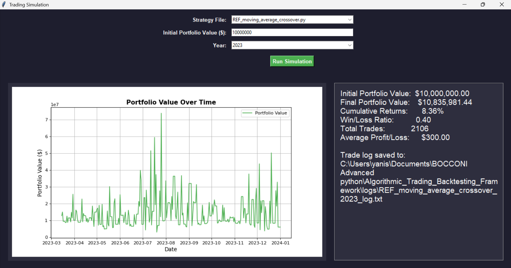

# Algorithmic Trading Backtesting Framework

This project implements a framework for **benchmarking automated trading strategies** on historical S&P 500 data.  
Users can plug in their own trading algorithm and evaluate its performance through historical backtesting.




---

## Overview

The simulator:

- downloads historical S&P 500 stock data using the **Yahoo Finance API**
- runs a trading strategy independently on each stock
- aggregates results into a portfolio
- computes performance metrics and visualizes portfolio evolution

The simulation outputs:

- portfolio value over time
- performance metrics (returns, win/loss ratio, number of trades)
- detailed **trade logs**

---

## Running the Simulator

The project is implemented as a **Jupyter Notebook**.

To run the simulator:

1. Open the notebook: `Algorithmic_Trading_Backtesting_SP500.ipynb`

2. Make sure required libraries are installed.

3. **Run all cells** in the notebook.

This will launch the **Trading Simulation interface**, where you can:

- select a trading strategy
- choose the year for backtesting
- set the initial portfolio value
- run the simulation and visualize results

---

## Trading Strategy Interface

Trading strategies are implemented as Python files in the `strategies` directory.

Each strategy must define the following function:

```python
def strategy(data, ticker, stock_holdings, cash):
    ...
    return final_cash, final_holdings, trade_log
```

This allows the framework to dynamically load and benchmark different trading algorithms.

---

## Trade Logs

After running a simulation, all executed trades are saved in the logs folder.

Each log file contains: Date, Stock, Action, Quantity, Price

This allows users to inspect all trading decisions made by the strategy during the backtest.

---

## Reference Strategies

The project includes several example strategies:

REF_moving_average_crossover.py

REF_bollinger_bands.py

REF_rsi_strategy.py

These strategies are provided for testing and benchmarking the framework.
